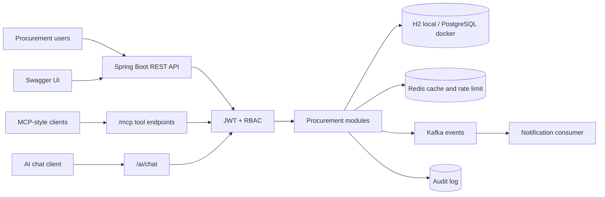
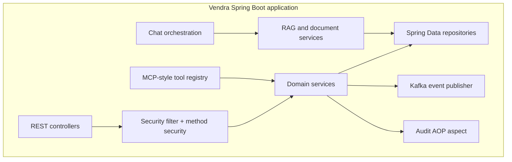
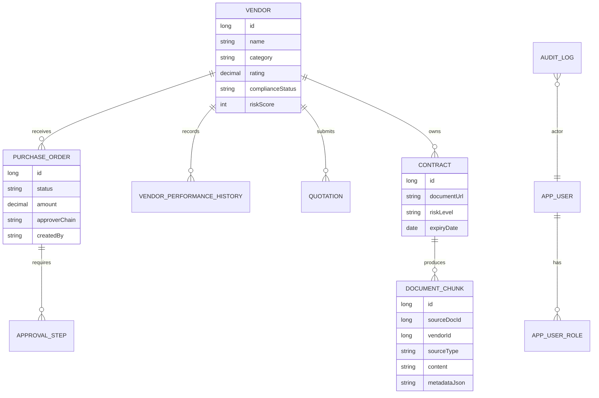
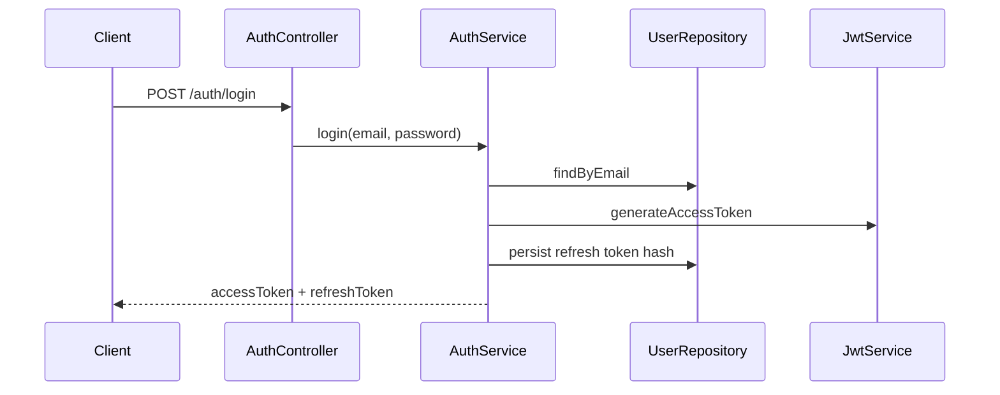
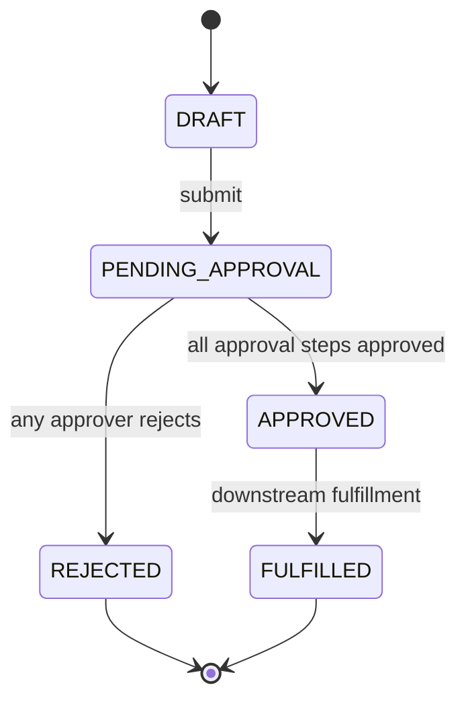
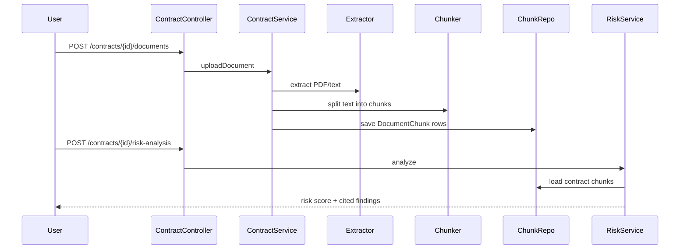

# Vendra Architecture

Vendra is implemented as a Spring Boot modular monolith. The application keeps modules in one deployable unit for simple local development and portfolio demos, while keeping package boundaries clear enough to split into services later.

## System Context

## Runtime Architecture

## Module Boundaries

| Package | Responsibility |
|---|---|
| `auth` | Users, roles, JWT login/refresh, security configuration |
| `vendor` | Vendor CRUD, filtering, risk score, performance history |
| `quotation` | Quote intake, RFQ listing, deterministic quote comparison scoring |
| `purchaseorder` | PO lifecycle, approval chain, approval/rejection workflow |
| `contract` | Contract records, document upload, risk analysis |
| `ai.rag` | Text extraction, chunking, chunk storage, keyword retrieval |
| `ai.chat` | Chat endpoint, rate limiting, lightweight orchestration |
| `ai.mcp` | Tool discovery and tool-call API over secured services |
| `inventory` | SKU stock lookup |
| `audit` | `@AuditLogged` annotation and audit log persistence |
| `notification` | Kafka consumer stub with idempotent processed-event storage |
| `infra.kafka` | Event DTOs and Kafka/no-op publisher abstraction |
| `infra.seed` | Demo users and sample procurement data |
| `common` | Shared DTOs, exceptions, error handling, security helpers |

## Domain Model

## Key Flows

### Authentication

### Purchase Order Approval

### Contract RAG and Risk Analysis

## Security Architecture

- JWT access tokens protect all non-public endpoints.
- Method-level RBAC is enforced with `@PreAuthorize` on services and controllers.
- Tool calls in `ai.mcp` reuse the same service methods as REST, so tools do not bypass authorization.
- Refresh tokens are stored as SHA-256 hashes on `AppUser`.
- Mutating workflows use `@AuditLogged`, which writes actor, action, entity, timestamp, and serialized arguments to `audit_logs`.

Roles:

- `ADMIN`
- `PROCUREMENT_OFFICER`
- `APPROVER_L1`
- `APPROVER_L2`
- `VENDOR_MANAGER`

## Event Architecture

Kafka is optional in the local profile and enabled in the Docker profile.

| Event | Producer | Consumer |
|---|---|---|
| `po.created` | `PurchaseOrderService` | Notification consumer |
| `po.approved` | `PurchaseOrderService` | Notification consumer |
| `po.rejected` | `PurchaseOrderService` | Notification consumer |
| `document.uploaded` | `ContractService` | Future RAG async worker |
| `vendor.risk.flagged` | Future risk scheduler | Notification consumer |

The current publisher logs events when Kafka is disabled. In Docker mode, it publishes to Kafka.

## Deployment Profiles

| Profile | Database | Cache | Kafka | Use case |
|---|---|---|---|---|
| default | H2 in-memory | Spring simple cache | Disabled | Fast local demo |
| test | H2 in-memory | Spring simple cache | Disabled | Unit/context tests |
| docker | PostgreSQL | Redis | Enabled | Integrated environment |

Docker Compose includes:

- App container
- PostgreSQL 16
- Redis 7
- Kafka
- Zookeeper

## API Surfaces

- Human-facing REST API: `/auth`, `/vendors`, `/quotations`, `/purchase-orders`, `/contracts`, `/inventory`
- AI chat endpoint: `/ai/chat`
- Tool API: `/mcp/tools` and `/mcp/tools/{toolName}/call`
- Documentation: `/swagger-ui.html`
- Operations: `/actuator/health`, `/actuator/info`, `/actuator/metrics`

## Extension Points

- Replace `HeuristicLlmClient` with an OpenAI-backed implementation.
- Replace keyword retrieval with pgvector cosine similarity.
- Move document ingestion from synchronous upload to a Kafka consumer.
- Add an outbox table for reliable event publication.
- Add Testcontainers for PostgreSQL, Redis, and Kafka integration flows.
